# Стартап в информационных технологиях
## Участники команды №1:

| ФИО                  | Роль                     |
| -------------------- | ------------------------ |
| Овчаренко Константин | Архитектор/Разработчик 💀 |
| Миняев Тимофей       | Маркетолог 🗣️           |
| Паркаев Илья         | Аналитик ✍️              |
| Савельев Сергей      | Тимлид/Дизайнер 🧑‍🎨    |
| Валянский Андрей     | Разработчик 💻           |

---
## Практическая неделя 4
## Тема практического занятия: Поиск инвесторов и привлечение инвестиций
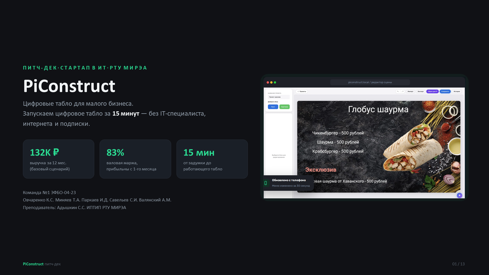
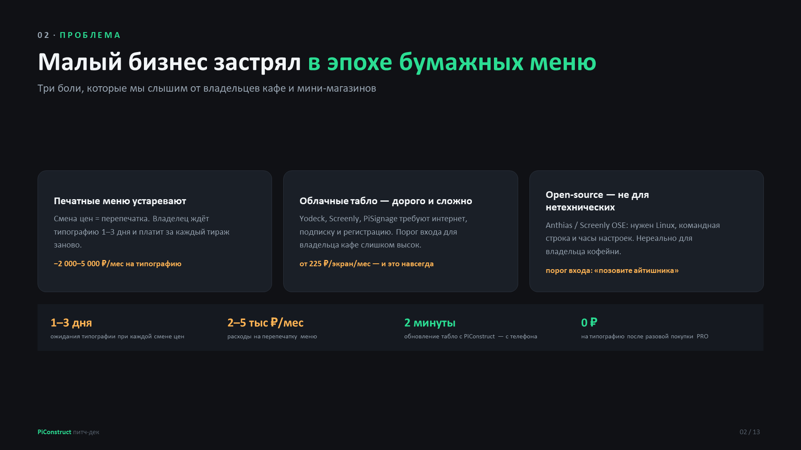
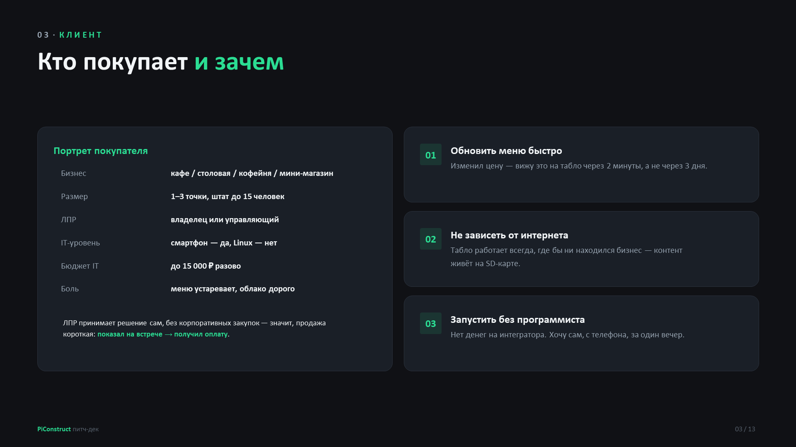
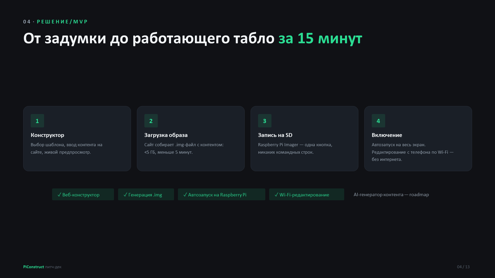
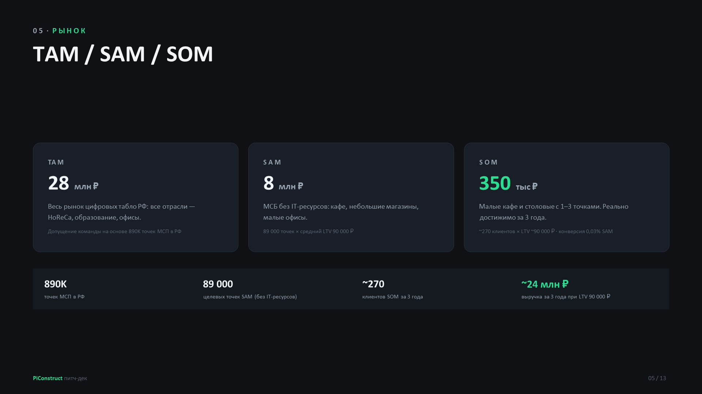
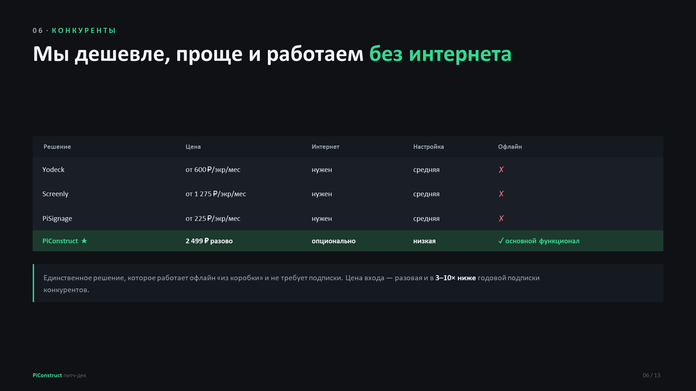
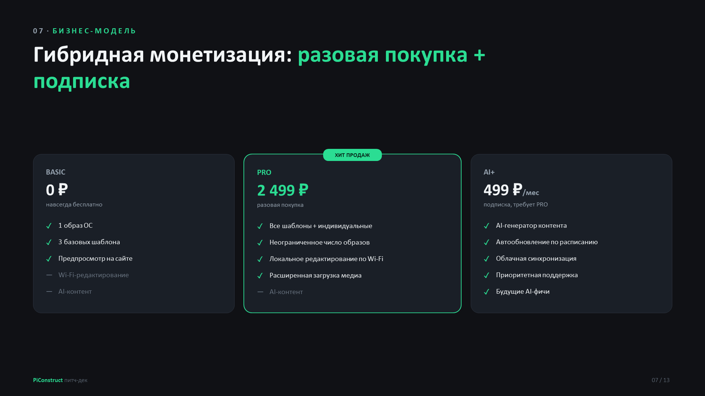
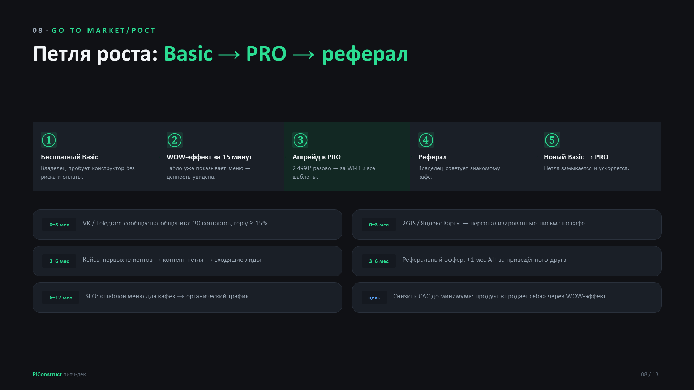
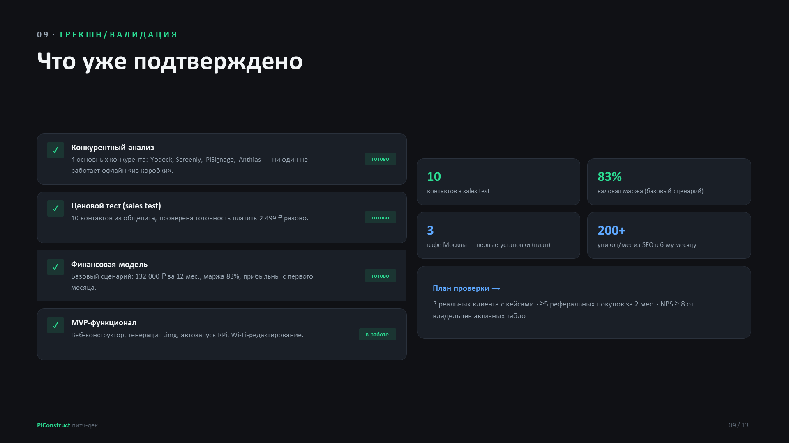
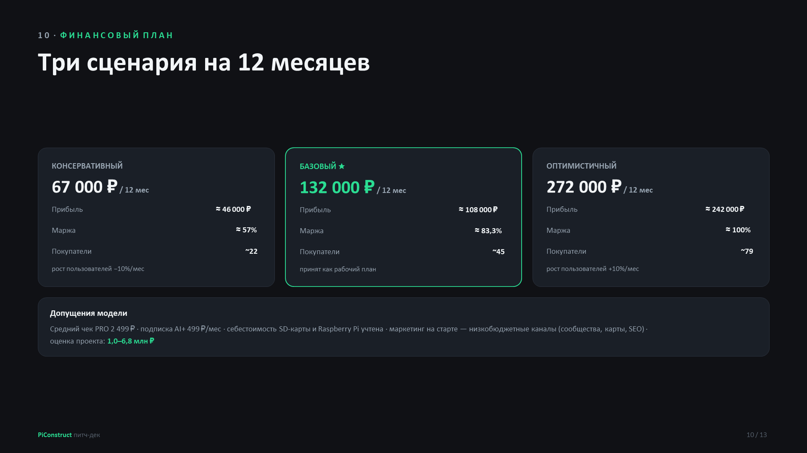
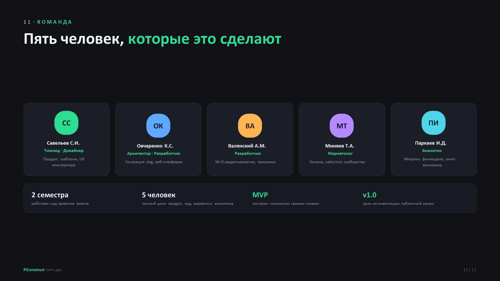
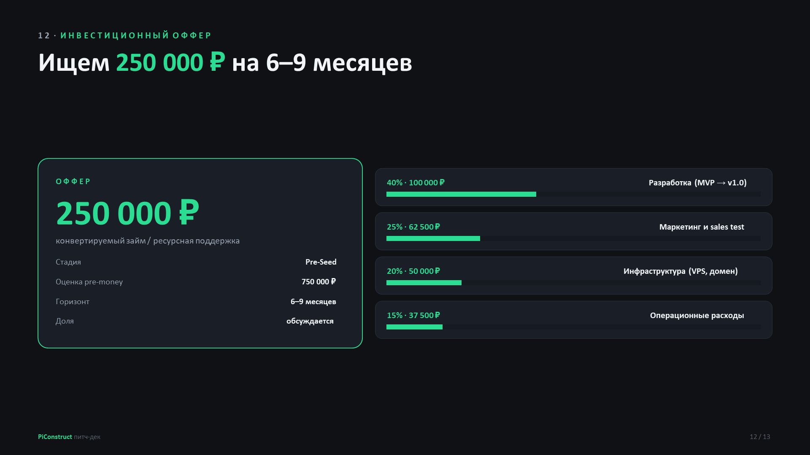
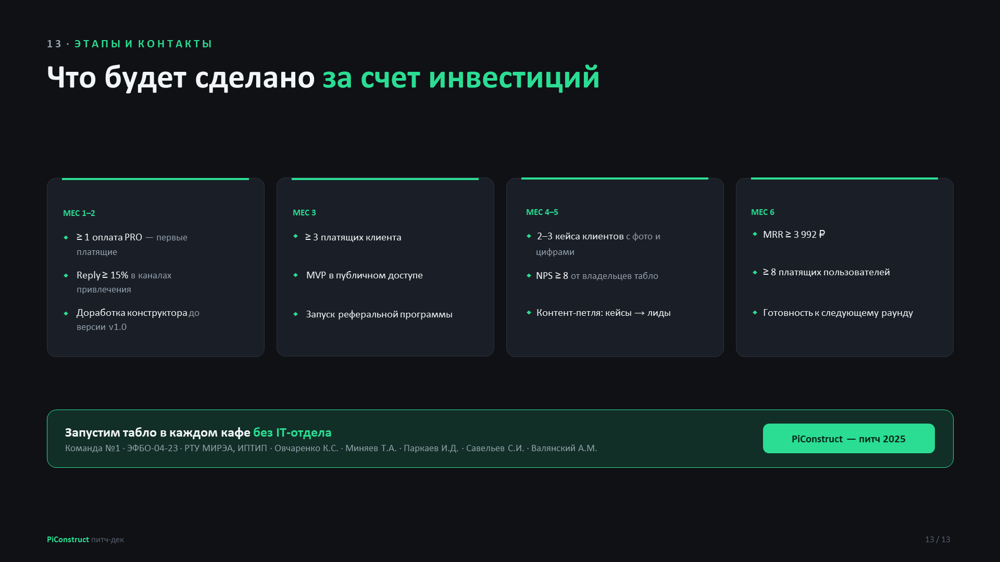

