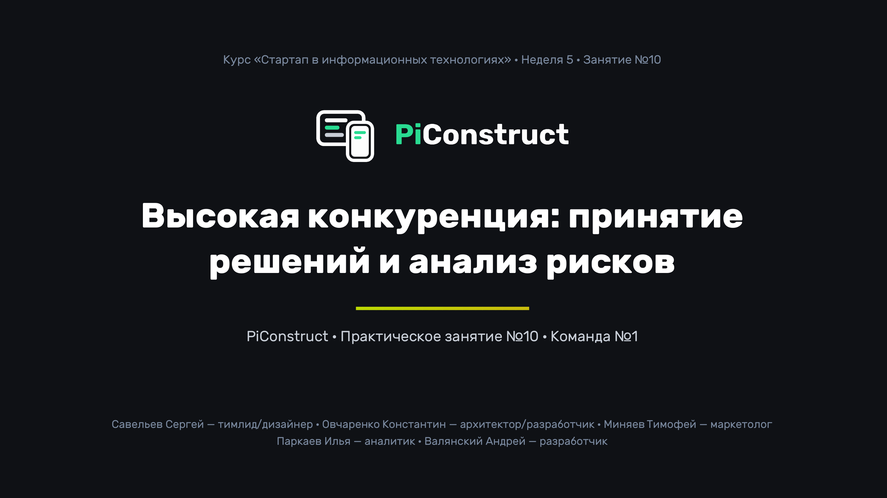
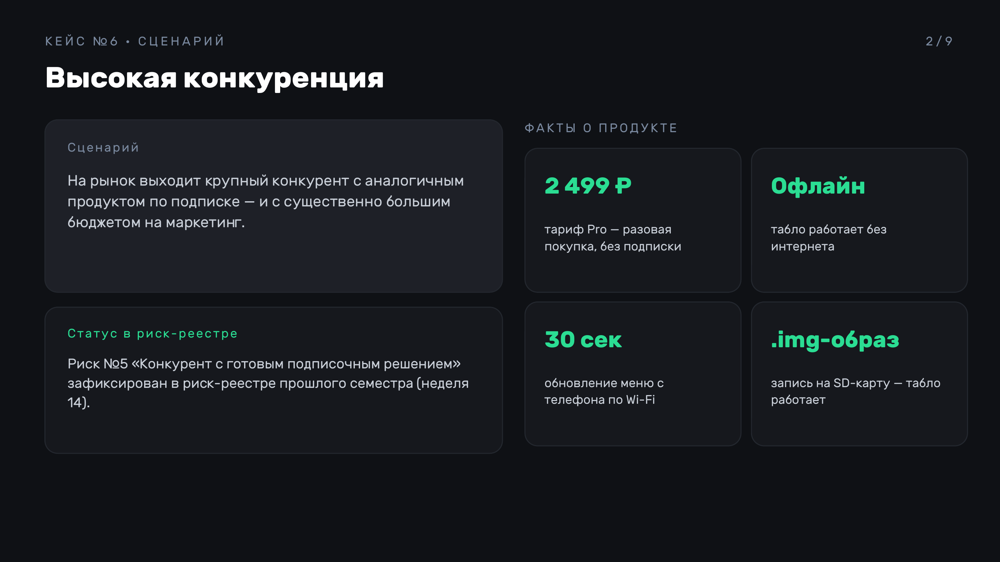
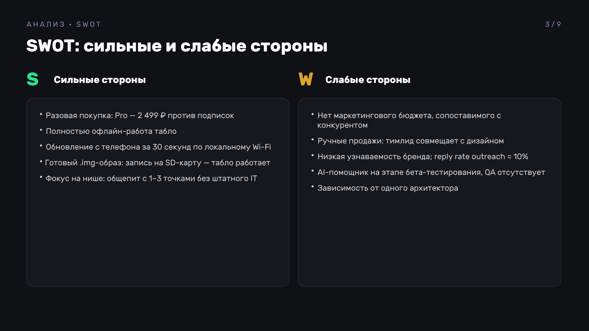
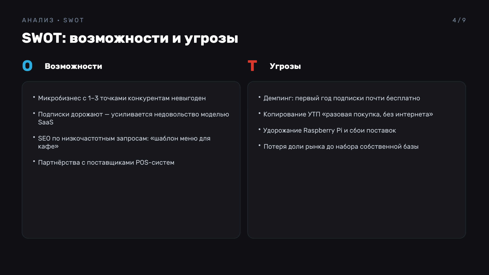
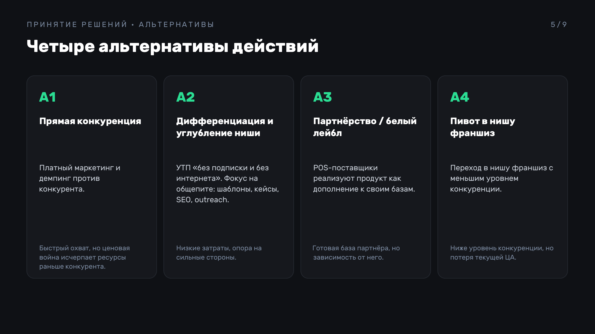
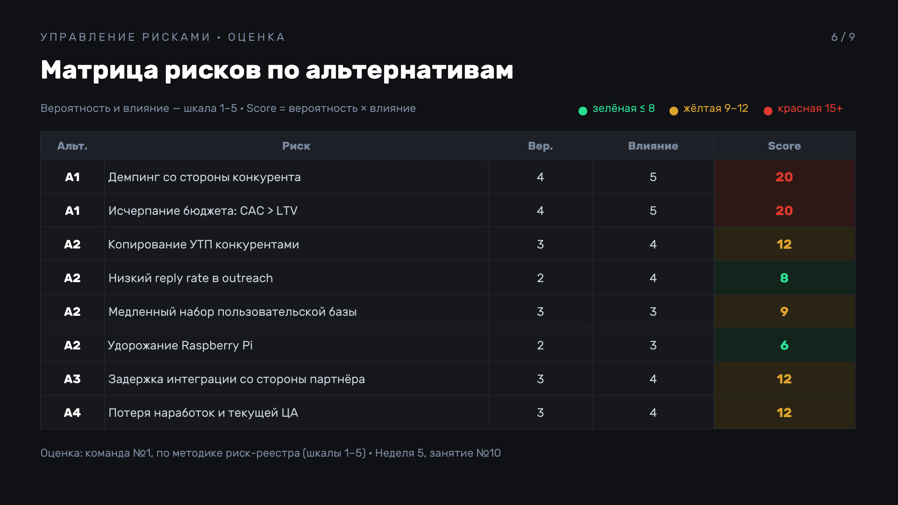
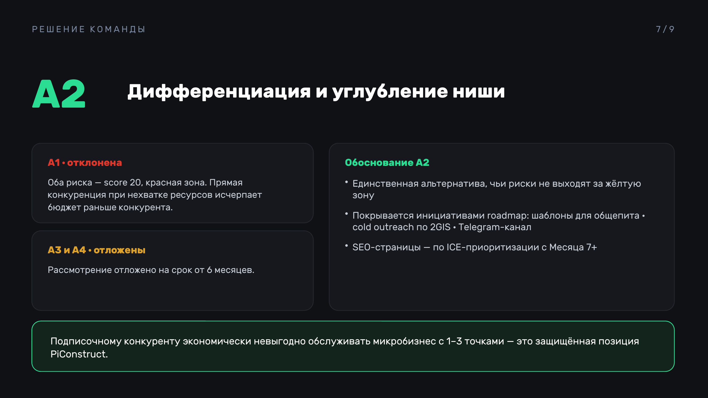
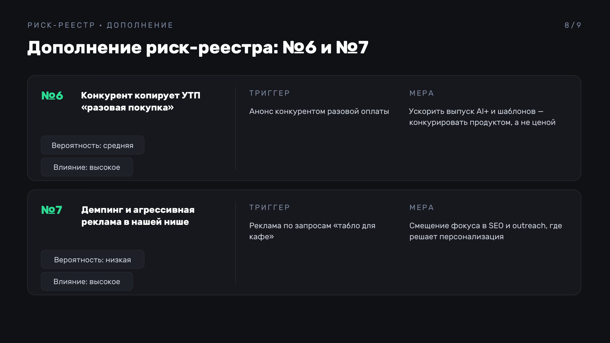
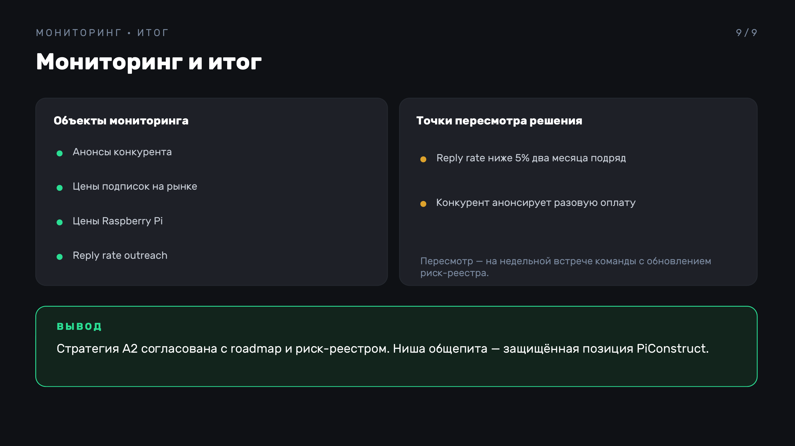

# Стартап в информационных технологиях
## Участники команды №1:

| ФИО                  | Роль                     |
| -------------------- | ------------------------ |
| Овчаренко Константин | Архитектор/Разработчик 💀 |
| Миняев Тимофей       | Маркетолог 🗣️           |
| Паркаев Илья         | Аналитик ✍️              |
| Савельев Сергей      | Тимлид/Дизайнер 🧑‍🎨    |
| Валянский Андрей     | Разработчик 💻           |

---
## Практическая неделя 5
## Тема практического занятия: Развитие навыков принятия решений, управления рисками, коммуникации с командой и клиентами

## Задание №1. Принятие решений и анализ рисков

**Выбранный кейс:** №6 «Высокая конкуренция». На рынок выходит крупный конкурент с аналогичным продуктом (digital signage по подписке), у которого существенно больше ресурсов на маркетинг. Для PiConstruct сценарий практически значим: риск «Конкурент с готовым подписочным решением» уже зафиксирован в риск-реестре прошлого семестра (неделя 14, риск №5).

### SWOT-анализ

| **S** | **W** |
|---|---|
| Разовая покупка (Pro — 2 499 ₽) против подписок конкурентов | Нет маркетингового бюджета, сопоставимого с конкурентами |
| Полностью офлайн-работа табло, интернет нужен только для обновления | Ручные продажи: тимлид совмещает их с дизайном и координацией |
| Обновление контента с телефона за 30 секунд по локальному Wi-Fi | Низкая узнаваемость бренда, первый cold outreach дал reply rate (RR, доля ответов) ≈ 10% |
| Готовый `.img`-образ: запись на SD-карту разворачивает рабочее табло, ИТ-специалист не требуется | AI-помощник в бете, нет QA-специалиста |
| Фокус на нише: общепит с 1–3 точками без штатного IT | Зависимость от одного человека на критическом пути (архитектор) |

| **O** | **T** |
|---|---|
| Конкуренты ориентированы на подписки и enterprise, микробизнес им невыгоден | Демпинг: первый год подписки по символической цене |
| Повышение цен на подписки усиливает недовольство моделью SaaS | Конкурент копирует УТП «разовая покупка, без интернета» |
| SEO по низкочастотным запросам («шаблон меню для кафе») | Удорожание Raspberry Pi, сбои поставок оборудования |
| Партнёрства с поставщиками POS-систем для общепита | Потеря рыночной доли до формирования клиентской базы |

### Альтернативные решения

| № | Альтернатива | Суть | Плюсы | Минусы |
|:-:|---|---|---|---|
| А1 | Прямая конкуренция | Нарастить платный маркетинг, снизить цену, конкурировать за ту же аудиторию | Быстрый охват | Бюджет на рекламу сопоставим с месячной выручкой; ценовая война исчерпает наши ресурсы раньше, чем ресурсы конкурента |
| А2 | Дифференциация и углубление ниши | Усилить УТП «без подписки и без интернета», сосредоточиться на общепите: 5 шаблонов, кейсы, SEO по низкочастотным запросам, cold outreach | Опирается на наши сильные стороны и слабости конкурента; низкие затраты; согласовано с roadmap прошлого семестра (неделя 14) | Клиентская база растёт медленнее; требуется систематический outreach |
| А3 | Партнёрство / белый лейбл | Интеграция с поставщиками POS-систем; продукт реализуется как дополнение к их решениям | Чужая клиентская база и доверие | Длинные переговоры, зависимость от партнёра (кейс №4) |
| А4 | Пивот в смежную нишу | Уйти от прямой конкуренции: сервис управления сетью табло для франшиз | Меньше конкуренции | Потеря текущей ЦА и наработок; повышенная сложность продаж |

### Оценка рисков по матрице

Шкала: вероятность и влияние от 1 (низкая) до 5 (критическая). Score = Вероятность × Влияние. Зелёная зона — до 8, жёлтая — 9–12, красная — 15 и выше.

| Решение | Риск | Вероятность | Влияние | Score | Стратегия |
|:-:|---|:-:|:-:|:-:|---|
| А1 | Демпинг конкурента разрушает текущую ценовую модель | 4 | 5 | 20 | Избегание |
| А1 | Выгорание бюджета без окупаемости (стоимость привлечения клиента выше его пожизненной ценности: CAC > LTV) | 4 | 5 | 20 | Избегание |
| А2 | Конкурент копирует УТП «разовая покупка» | 3 | 4 | 12 | Принятие + мониторинг |
| А2 | Низкий reply rate при углублении в нишу общепита | 2 | 4 | 8 | Снижение: персонализация, смена каналов |
| А2 | Медленный рост клиентской базы | 3 | 3 | 9 | Снижение: шаблоны, кейсы, Telegram-канал |
| А2 | Удорожание Raspberry Pi снижает ценность предложения | 2 | 3 | 6 | Принятие, мониторинг цен поставщиков |
| А3 | Партнёр тормозит интеграцию или отказывается от неё | 3 | 4 | 12 | Снижение: 2–3 партнёра параллельно |
| А4 | Потеря текущих наработок и ЦА | 3 | 4 | 12 | Избегание |

### Выбранное решение

**А2 — дифференциация и углубление ниши.** А1 отклонена: оба её риска (score 20) относятся к красной зоне матрицы; ресурсов для прямой ценовой конкуренции у нас недостаточно. А3 и А4 отложены на срок от шести месяцев: А3 добавляет зависимость от партнёра (кейс №4), А4 обесценивает текущую ЦА и продукт. А2 — единственная альтернатива, чьи риски не выходят за жёлтую зону и уже покрываются инициативами из roadmap (шаблоны для общепита, cold outreach по 2GIS, Telegram-канал; SEO-страницы — по ICE-приоритизации с Месяца 7+). Для конкурента с подписочной моделью микробизнес из 1–3 точек экономически непривлекателен — эта ниша составляет нашу устойчивую конкурентную позицию.

Дополнение к риск-реестру прошлого семестра (неделя 14):

| № | Риск | Вероятность | Влияние | Триггер для реакции | Мера |
|:-:|---|:-:|:-:|---|---|
| 6 | Конкурент копирует УТП «разовая покупка» | Средняя | Высокое | Анонс конкурентом разовой оплаты | Ускорить выпуск AI+ и шаблонов, конкурировать продуктом, а не ценой |
| 7 | Демпинг и агрессивная реклама конкурента в нашей нише | Низкая | Высокое | Реклама конкурента по запросам «табло для кафе» | Смещение усилий в SEO и outreach, где результат определяется персонализацией, а не бюджетом |

Результаты оформлены в виде презентации (кейс → SWOT → альтернативы → матрица рисков → решение → мониторинг): [PiConstruct_Задание1.pptx](attachments/PiConstruct_Задание1.pptx).

---

## Задание №2. Коммуникация и командная работа

**Сценарий:** №1 «Срочное обновление продукта». Клиенты сообщили о критическом дефекте: при прошивке экспортированного `.img`-образа последней версии табло показывает чёрный экран вместо сцены. Затронуты все пользователи, экспортировавшие образ за последние сутки. Требуется исправление и выпуск обновления в течение 24 часов.

### Организация коммуникации

- Единый канал инцидента — приватный чат в Telegram: все решения фиксируются в нём; исключается потеря информации в личной переписке.
- Статус-поток для клиентов — публичная ветка в Telegram-канале и рассылка по затронутым пользователям: проблема зафиксирована, исправление ведётся, обновление статуса ежечасно.
- Роли и задачи:

| Участник | Роль в инциденте | Задачи |
|---|---|---|
| Савельев Сергей | Incident Commander | Координация, безусловный приоритет исправления, решение о релизе, точка эскалации |
| Овчаренко Константин | Tech Lead исправления | Диагностика пайплайна сборки `.img`, локализация дефекта, hotfix |
| Валянский Андрей | Разработчик | Воспроизведение дефекта на эмуляторе, тестирование исправления, откат или патч сборки |
| Паркаев Илья | Аналитик | Масштаб инцидента (heartbeat-телеметрия — периодические сигналы работающих табло), оценка ущерба, пост-мортем |
| Миняев Тимофей | Communications Lead | Коммуникация с клиентами, обновления статуса, ответы на возражения |

Принципы: единый командир инцидента исключает эстафету указаний; обновление в чат каждые 30–60 минут, в том числе при отсутствии новостей; клиентам сообщаются факты и ETA (оценка времени готовности) без неисполнимых обещаний.

### План действий

Время указано в часах от объявления инцидента (T+0).

| Время | Шаг | Ответственный | Результат |
|---|---|---|---|
| T+0 – T+1 | Объявление инцидента, приостановка экспорта `.img`, баннер в конструкторе и на лендинге | Савельев / Овчаренко | Исключена выдача дефектных образов |
| T+0 – T+2 | Диагностика: сравнение последней работоспособной и дефектной сборки, поиск коммита, внёсшего регрессию | Овчаренко + Валянский | Локализованная причина дефекта |
| T+1 – T+2 | Оценка масштаба: кто экспортировал образ за окно инцидента (логи, метрика) | Паркаев | Список затронутых для точечной рассылки |
| T+1 | Первое сообщение клиентам: проблема подтверждена, ведём работу, ETA к T+4 | Миняев | Клиенты информированы из первоисточника |
| T+2 – T+8 | Hotfix, пересборка `.img`, проверка на эмуляторе и на реальной Raspberry Pi 5 | Овчаренко + Валянский | Исправленный образ |
| T+8 – T+12 | Регресс-тест полного цикла: сцена → экспорт → прошивка → работа табло → обновление по Wi-Fi | Валянский + Паркаев | Фикс не ломает остальное |
| T+12 – T+14 | Релиз: разблокировка экспорта, баннер об устранении проблемы и повторной прошивке SD-карты | Савельев | Обновление доступно |
| T+12 – T+16 | Точечная рассылка затронутым с инструкцией по повторной прошивке + месяц AI+ бесплатно | Миняев | Затронутые клиенты восстановили работу табло |
| T+16 – T+24 | Мониторинг метрик (экспорты, heartbeat), сбор обратной связи | Паркаев | Подтверждение восстановления сервиса |
| T+24 | Пост-мортем: причины попадания дефекта в производственную среду, какой автотест позволил бы его обнаружить, добавление теста в CI | Паркаев + Овчаренко | Повторение дефекта исключено |

**Комментарий:** первым действием закрывается источник новых пострадавших (баннер и приостановка экспорта), и только затем начинается исправление — иначе поток дефектных образов продолжал бы расти во время разработки. Точечная рассылка вместо общей публикации оправдана: телеметрия позволяет точно определить круг затронутых пользователей. Компенсация незначительна по стоимости, но переводит инцидент в демонстрацию ответственности компании. Пост-мортем обязателен: сбои сборки `.img` — ключевой технический риск из реестра прошлого семестра (неделя 14, риск №4); системный ответ на него — автотесты в CI.

---

## Задание №3. Взаимодействие с клиентом

**Контекст:** cold outreach по 2GIS нашёл кафе «Пирожок и ко» (1 точка, владелец самостоятельно работает за кассой, ИТ-специалиста нет, печатное меню, рассматривал подписку конкурента за 990 ₽/мес). Согласился на 15-минутную онлайн-встречу.

**Роли в ролевой игре:** представитель стартапа — Миняев Тимофей, клиент — Паркаев Илья, наблюдатели — Савельев, Овчаренко, Валянский.

### Сценарий диалога

**Представитель:** Сергей Викторович, вы говорили, что печатное меню вас устраивает. Что изменилось, что согласились на созвон?

**Клиент:** Меню-то устраивает. Просто каждый раз, когда меняется цена на сыр, я трачу вечер на перепечатку. Подписку вашего конкурента смотрел — 990 в месяц, в год почти 12 тысяч. Для одного кафе дороговато.

**Представитель:** А сколько раз в месяц у вас меняется меню?

**Клиент:** Раза два–три. Плюс каждую неделю — бизнес-ланч.

**Представитель:** Получается, два–три обновления меню и каждую неделю бизнес-ланч — это 6–7 часов в месяц на перепечатку. PiConstruct покупается один раз за 2 499 рублей, дальше никаких платежей за само табло — меньше, чем год подписки конкурента, а работает годами. Даже если ваш час стоит всего 300–400 рублей, табло окупится сэкономленным временем за месяц–полтора.

**Клиент:** Хорошо, а железо? Я в этом ноль. Мне что, Raspberry самому прошивать?

**Представитель:** Прошивка — один раз записать готовый файл на карту памяти, видеоинструкция на 5 минут. Дальше табло работает само, без интернета. Меню меняете с телефона: поправили цену, нажали «обновить» — через 30 секунд табло показывает новое. Всё по вашей Wi-Fi-сети.

**Клиент:** А если эта ваша плата сломается или свет вырубят?

**Представитель:** Свет вырубят — тёмный экран, как у любого экрана, при включении всё подхватится само. Если плата выйдет из строя — записываете тот же образ на карту, вставляете в новую плату, табло работает. Ваши меню хранятся в аккаунте в конструкторе, ничего не теряется.

**Клиент:** А если я заплачу 2 499, а оно мне не зайдёт?

**Представитель:** Прежде чем платить — бесплатный тариф: собираете сцену и смотрите, как она выглядит, деньги нужны только на этапе экспорта готового образа. Плюс 5 готовых шаблонов для общепита: меню, бизнес-ланч, акции. За сегодня соберёте своё меню и увидите результат до оплаты.

**Клиент:** Ладно, давайте попробую бесплатный тариф, посмотрим.

### Разбор ролевой игры

Наблюдатели отметили:

- Уточняющие вопросы в начале (частота смены меню): далее ценность рассчитана на данных клиента, а не на наших предположениях.
- Сравнение с конкурентом в деньгах клиента (2 499 ₽ единоразово против 11 880 ₽/год подписки), а не абстрактное утверждение «мы дешевле».
- Возражение «я в этом ноль» снято конкретными действиями: одноразовая запись файла, видеоинструкция на 5 минут, дальнейшее управление с телефона.
- Финал на бесплатном тарифе и шаблоне: клиент рискует только временем, барьер входа минимальен.

Замечания:

- Цена названа до выяснения бюджета клиента; корректный порядок — сначала бюджет, затем цифры.
- Ответ о поломке оборудования длинный для устной реплики; краткая версия: образ хранится в аккаунте, новая плата работает с той же SD-картой.
- Не прозвучал вопрос о сроках решения. Согласие «давайте посмотрим» без установленной даты редко приводит к сделке — необходим следующий шаг с датой: «вернёмся в четверг и вместе разберём собранный шаблон».

**Рекомендации (в скрипт outreach):**

- Начинать с 2–3 уточняющих вопросов и рассчитывать экономию на данных клиента.
- Ответы на возражения готовить заранее, вопросы из ролевой игры добавить в FAQ лендинга.
- Заканчивать каждый диалог конкретным следующим шагом с датой.

---

## Выводы

**Принятие решений.** Проработана последовательность SWOT → альтернативы → матрица рисков → решение на кейсе конкуренции. Выбрана стратегия дифференциации в нише общепита, в риск-реестр добавлены два новых риска (№6 — копирование УТП, №7 — демпинг конкурента) с триггерами для реакции.

**Командная коммуникация.** Отработана кризисная коммуникация по сценарию срочного обновления: единый канал инцидента, Incident Commander, обновления статуса каждые 30–60 минут, пост-мортем с автотестом в CI. План согласован с риск-реестром прошлого семестра (неделя 14).

**Взаимодействие с клиентом.** Главный вывод ролевой игры: ценность следует рассчитывать на данных клиента, а каждый диалог завершать следующим шагом с датой. Выводы включены в скрипт outreach и FAQ лендинга.
