# Стартап в информационных технологиях
## Участники команды №1:

| ФИО                  | Роль                     |
| -------------------- | ------------------------ |
| Овчаренко Константин | Архитектор/Разрабочик 💀 |
| Миняев Тимофей       | Маркетолог 🗣️           |
| Паркаев Илья         | Аналитик ✍️              |
| Савельев Сергей      | Тимлид/Дизайнер 🧑‍🎨    |
| Валянский Андрей     | Разработчик 💻           |

---
## Практическая неделя 11
## Конструирование и проверка модели монетизации. Тест продажами. Формирование финансовой модели.
Сформировать у обучающихся навыки проектирования и первичной проверки модели монетизации стартап-проекта, включая разработку ценовой логики и упаковки предложения, планирование и проведение «теста продажами» (sales test) для получения рыночных сигналов, а также построение упрощённой финансовой модели, отражающей взаимосвязь выручки, затрат, воронки продаж и ключевых допущений.
## Материалы недели
### Презентация
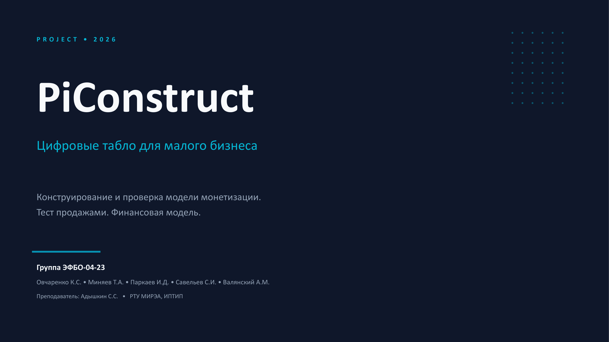
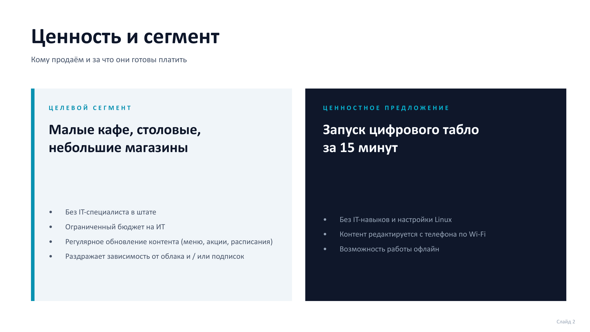
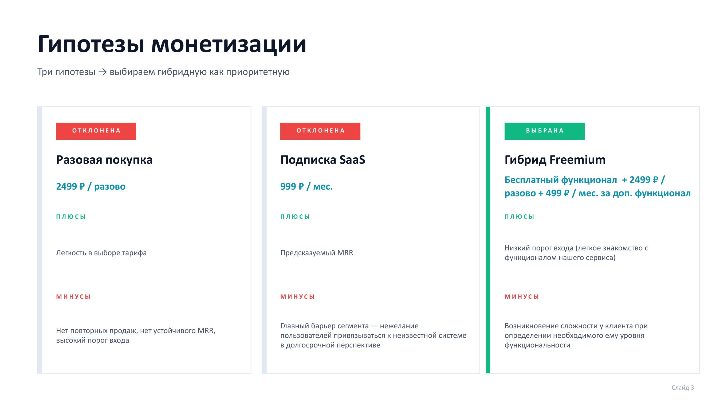
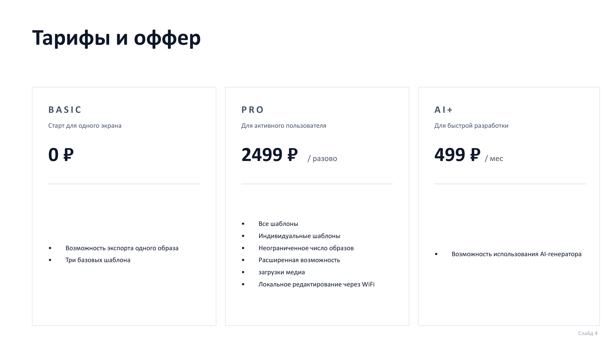
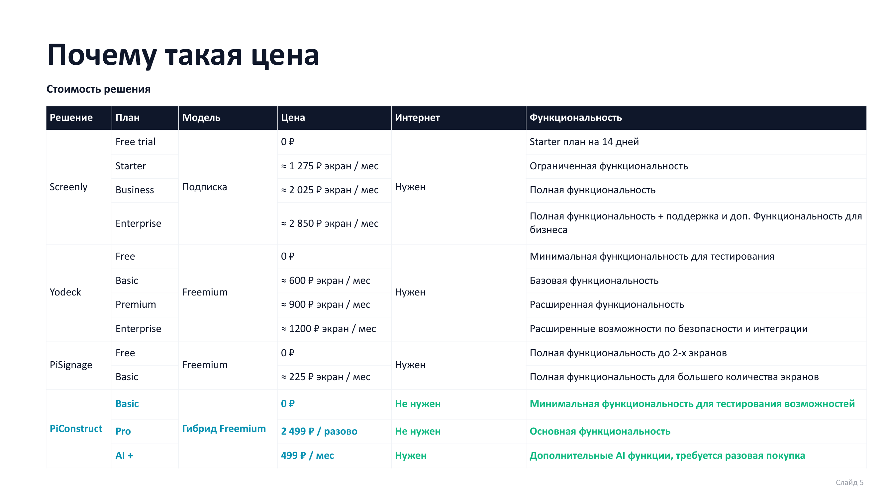
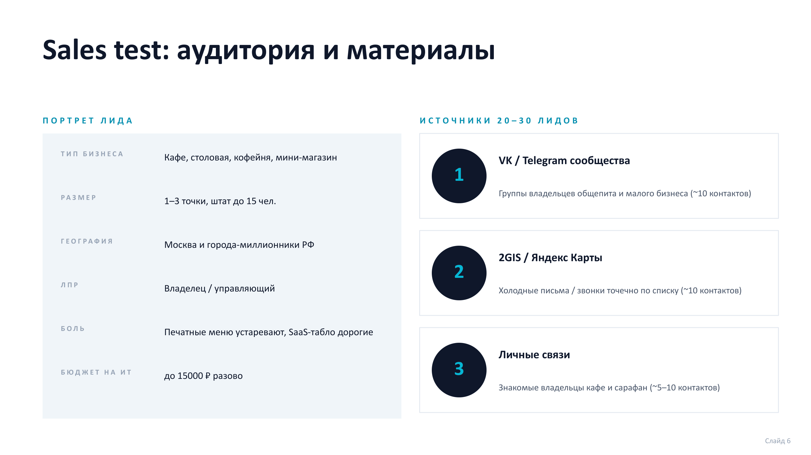
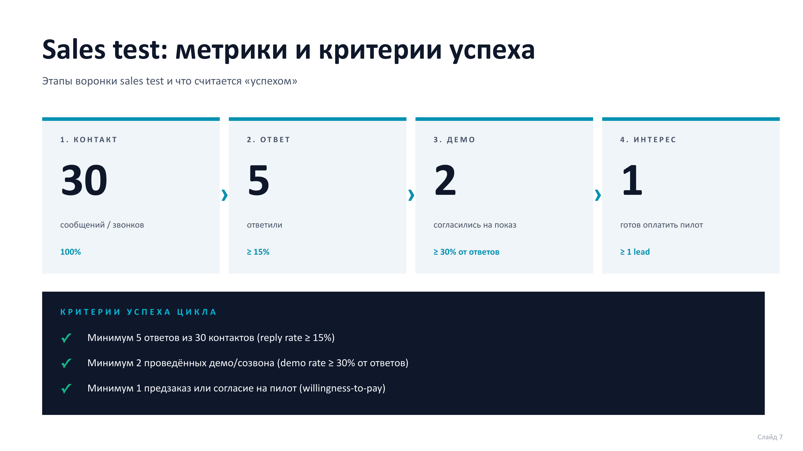
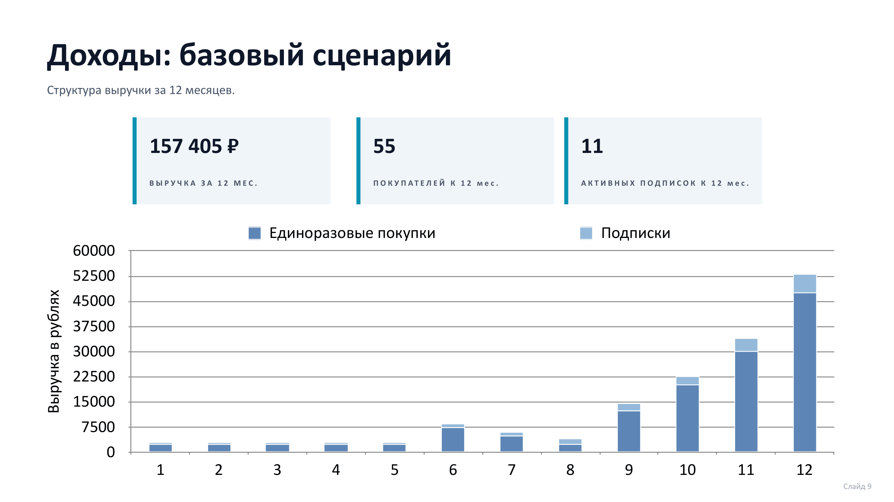
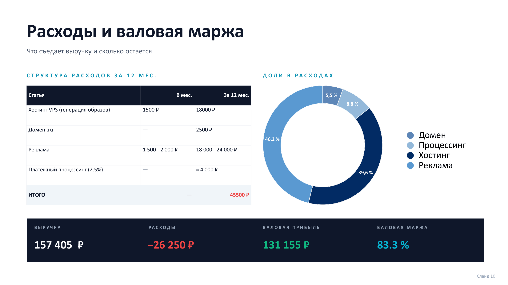
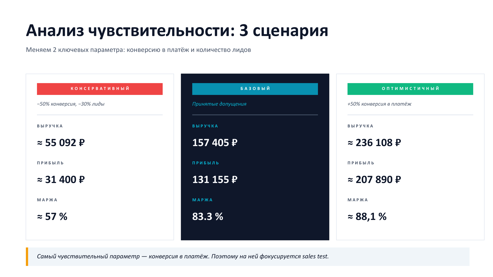
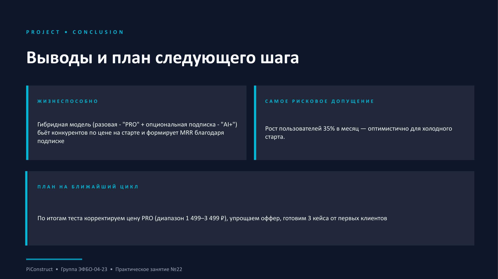

### Таблица
